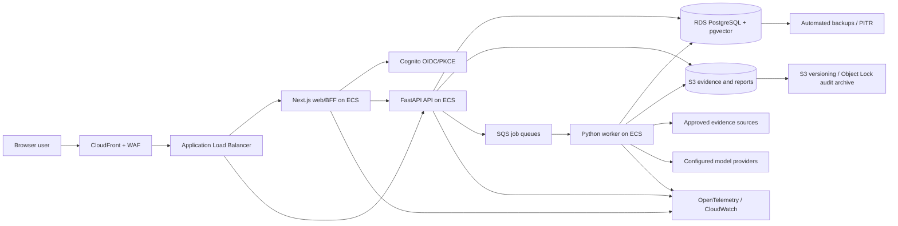

# VYU Production Platform Design

**Status:** Approved architecture specification awaiting written-spec review  
**Date:** 2026-07-05  
**Repository:** `D:\PROJECT_VYU`  
**Target:** Deployable, non-PHI, governed biomedical research SaaS  
**Primary cloud:** AWS, initially `ap-south-1`  

---

## 1. Executive Decision

VYU will be completed as an AWS-hosted modular monolith with independently scaled web, API, and worker processes. The first production release is a governed research-support platform for public biomedical literature and explicitly approved non-PHI tenant documents. It is not a diagnostic system, treatment recommender, patient-specific clinical decision-support system, medical device, or autonomous clinical decision maker.

The production deployment will use:

- Next.js for the web application and browser-facing backend-for-frontend boundary.
- FastAPI for a versioned REST API and generated OpenAPI contract.
- A separate Python worker process built from the same backend package.
- Amazon ECS Fargate for web, API, worker, and migration tasks.
- Amazon RDS for PostgreSQL with `pgvector` for transactional data, lexical search, and the first vector index.
- Amazon S3 for uploaded documents, normalized evidence objects, generated reports, audit bundles, and immutable release evidence.
- Amazon SQS with dead-letter queues for ingestion, research, synthesis, and export jobs.
- Amazon Cognito with authorization-code flow and PKCE for human users, plus scoped service credentials for machine clients.
- AWS Secrets Manager and KMS for secrets and encryption keys.
- CloudFront, an Application Load Balancer, AWS WAF, private subnets, and least-privilege IAM.
- OpenTelemetry plus CloudWatch for metrics, traces, structured logs, dashboards, alarms, and audit correlation.
- Terraform for reproducible `dev`, `staging`, and `prod` environments.
- GitHub Actions for tests, security checks, image builds, Terraform plans, staged deployment, and promotion.

This design intentionally avoids Kubernetes and early microservice decomposition. VYU currently has one Python domain package and a small team-oriented codebase. Splitting it into networked services before the production boundaries are stable would add operational failure modes without improving the product.

### 1.1 Platform version policy

The first production baseline uses Python 3.13, Next.js 16 with React 19, PostgreSQL 17, and Terraform 1.x. Exact dependency, provider, container-base, PostgreSQL minor, and `pgvector` versions are locked after staging compatibility tests. Runtime images and Terraform providers are pinned by digest or lock checksum; floating `latest` tags and unconstrained production dependencies are prohibited. Node.js uses the active LTS release supported by the selected Next.js 16 patch and is recorded in `.nvmrc`, `package.json`, CI, and the web container.

## 2. Approved Product Boundary

### 2.1 Intended use

VYU helps researchers, evidence specialists, compliance reviewers, policy teams, and clinicians acting in a research capacity to:

1. Search approved biomedical sources.
2. Inspect retrieved evidence and provenance.
3. Generate evidence-grounded summaries with explicit citations.
4. Review uncertainty, contradictions, evidence quality, and system warnings.
5. Route high-risk or low-confidence results through human review.
6. Export approved research reports with their governance history attached.

### 2.2 Allowed data for the first release

- Public bibliographic metadata and abstracts obtained under approved source terms.
- Public full text only where licensing and source policy explicitly permit it.
- Synthetic test data.
- Tenant documents that the uploader attests are non-PHI and that pass automated file, malware, and sensitive-data screening.
- User identity, tenant membership, operational metadata, review comments, and audit events needed to operate the service.

### 2.3 Prohibited data and uses

- Protected health information or electronic protected health information.
- Raw patient records, clinical notes, laboratory records, imaging, or patient identifiers.
- Patient-specific diagnosis, treatment selection, triage, dosing, or prognosis.
- Autonomous decisions with clinical, legal, employment, insurance, or regulatory effect.
- Unreviewed external full-text scraping.
- Use of an unapproved source, model, prompt, index, or methodology version.
- Export of a high-risk result before its required review is approved.

The API, upload service, user interface, terms, and audit records must enforce this boundary. A future PHI-capable product is a separate program requiring a new threat model, privacy architecture, vendor agreements, compliance controls, validation plan, and explicit approval. It is not an extension flag in this release.

## 3. Audit Basis and Status Vocabulary

This specification was derived from the current working tree, the supplied 20-component roadmap, existing production documentation, source code, configuration examples, patch archives, generated outputs, and executable checks.

Status terms have precise meanings:

- **Implemented locally:** Source and tests exist and execute in the local POC.
- **Production-shaped:** Interfaces or records resemble a production boundary but still depend on local files, SQLite, fixtures, static configuration, or direct function calls.
- **Reference-only:** Code exists only inside an unapplied patch or archive and is not part of the running repository.
- **Missing:** No integrated implementation exists.
- **Production-ready:** Deployed in staging and production with operational, security, performance, recovery, and release evidence. Nothing in the current repository meets this definition end to end.

## 4. Verified Current State

### 4.1 Executable evidence

| Check | Verified result | Interpretation |
| --- | --- | --- |
| Python test suite | 388 tests passed in 270.759 seconds; one live PubMed test skipped | Strong local behavioral coverage, but no deployed-system proof |
| Next.js production build | Passed | The current frontend shell compiles |
| Next.js lint | Passed | No current ESLint errors |
| Frontend tests | Failed because no test files exist | Frontend behavior has no automated test coverage |
| Serverless package manifest validation | Passed 9 local manifest checks | Packaging contract is internally consistent, not cloud-ready |
| Local operator example validation | Passed only with placeholder-secret allowance | Example syntax is valid; it is not deployable configuration |
| Current local readiness command | Failed | `outputs/production.sqlite` is schema version 5 while source expects version 9; later tables are absent |
| Terraform validation | Not executable because Terraform is not installed in the audit environment | Cognito Terraform remains unverified by tooling in this workspace |
| Git history | No commits on `master`; all repository content is untracked | There is no trustworthy change lineage or rollback baseline |

### 4.2 Critical repository-integrity findings

1. The repository has no baseline commit. Production work must not begin until source, approved generated assets, and exclusions are classified and committed.
2. `.gitignore` excludes Python caches and `.venv` but does not exclude `node_modules`, `.next`, local environment files, logs, generated outputs, SQLite databases, Terraform state, IDE files, coverage, or local secrets.
3. The checked-in-looking `outputs/pilot_release_decision.json` says `approved_for_pilot`, but it refers to an older local synthetic run and contradicts current readiness. It must never be presented as current production authorization.
4. Running the current readiness command records a new result in SQLite. Readiness checks need an explicit read-only mode for CI and a separately authorized record mode.
5. `src/vyu/storage/production.py` is approximately 4,300 lines and binds domain records directly to SQLite. It must be replaced by focused PostgreSQL repositories and versioned Alembic migrations.
6. The Python project declares no runtime dependencies, build backend, lock file, CLI entry points, lint configuration, type-check configuration, or package discovery rules.
7. The frontend contains `node_modules` and generated `.next` artifacts in the working tree, while neither is ignored.
8. The existing package manifest explicitly says infrastructure is managed elsewhere. It cannot deploy a service.

### 4.3 Patch archive classification

The patch folders are historical reference material, not source of truth.

- Patches v10-v12 correspond to OIDC, Cognito, and Research MCP capabilities that are substantially present in the current source.
- Patch v13 describes a broader AWS SaaS scaffold, but its `infra/` tree and several runtime packages are absent.
- Patch v14 contains an ingestion layer, but its service, object-store, route, script, and tests are absent.
- Patch v15 contains a model gateway, but `src/vyu/model_gateway` and its routes are absent.
- Patch v16 contains grounded synthesis, but `src/vyu/synthesis` and its routes are absent.
- None of v13-v16 applies cleanly to the current working tree.

No junior developer may run `git apply` on these patches. Required behavior must be extracted into a fresh, reviewed implementation against the current architecture, with new tests and migrations.

## 5. Component-by-Component Readiness

| # | Component | Current repository truth | Production requirement |
| ---: | --- | --- | --- |
| 1 | Product experience | Dashboard shell exists and defaults to fixture data. Search, results, sources, governance, reviews, uploads, evidence library, reports, and workspace pages are placeholders. | Complete authenticated workflows bound to typed APIs, loading/error/empty states, accessibility, responsive layouts, and browser tests. |
| 2 | Identity and tenant governance | OIDC/JWKS validation, identity mapping, local tenant registry, roles, and API-key seams exist. Membership is file-backed. | Cognito PKCE login, PostgreSQL-backed membership, service credentials, tenant administration, revocation, access reviews, and enforced tenant isolation. |
| 3 | Source governance and Research MCP | Source/tool registries, source gates, planning, audit, replay, PubMed transport, and API/worker adapters exist. They are not composed into the deployed route runtime. | Persistent source policy, route integration, live PubMed, connector quotas, replay fixtures, connector health, and approved-source enforcement. |
| 4 | Evidence ingestion | Synthetic JSONL/PDF fixtures only. v14 is reference-only. | Presigned upload, malware and PHI screening, parsing, metadata, deduplication, document versioning, chunking, object storage, lineage, and job status. |
| 5 | Evidence memory and retrieval | Local BM25, deterministic dense placeholder, RRF, SQLite control-plane records, and synthetic evaluation exist. | PostgreSQL full-text and pgvector indexes, embedding generation, reproducible index manifests, filters, reranking, benchmark thresholds, and trace APIs. |
| 6 | Evidence grading | Deterministic profiles, contradiction checks, methodology records, reviewer ratings, and external-provider seams exist. | Clinically reviewed methodology, locked versions, regression tests, reviewer workflow, specialty policies, and validated thresholds. |
| 7 | Model gateway | Missing from integrated source; v15 is reference-only. | Provider-neutral gateway, credentials, routing, timeouts, retries, budgets, structured outputs, prompt registry, safety checks, and full audit. |
| 8 | Grounded synthesis | Deterministic POC answer generator only; v16 is reference-only. | LLM-backed synthesis over approved context, claim/citation mapping, unsupported-claim detection, abstention, contradiction disclosure, and persisted output versions. |
| 9 | Governance Box and Trust Score | Strong deterministic local records, reviewer overrides, and external-provider seams exist. | Integrate with every research run, persist policy/version inputs, expose APIs/UI, enforce review/export decisions, and validate methodology. |
| 10 | Human review | Queue, decisions, authorization, API/worker adapters, and route runtime exist. UI is a placeholder. | Assignment, comments, evidence inspection, escalation, aging, notification, role separation, immutable decision history, and browser workflow. |
| 11 | Reports and exports | Markdown templates, local artifact lookup, export gate, route, and audit records exist. | Background PDF/DOCX generation, S3 versioning, signed download, watermark/status, governance appendix, retention, and export history. |
| 12 | Enterprise governance | Intended-use, privacy, safety, threat, and release documentation exists. | Policy registry, deployment authorization records, scorecards, owner approvals, policy-as-code checks, and evidence retention. |
| 13 | Local governance gateway | Missing beyond the privacy gate. | Excluded from first production scope. It becomes a separate product when PHI/customer-side execution is approved. |
| 14 | Safety envelope and monitoring | Local readiness and decision artifacts exist. | Runtime safety policies, quality gates, drift/failure metrics, incident triggers, rollback criteria, and continuous evaluation. |
| 15 | Audit and provenance | SQLite audit events and multiple local evidence records exist. | Append-only PostgreSQL event log plus S3 Object Lock archive, correlation IDs, actor/source/model/index/policy lineage, query API, and reconstruction tests. |
| 16 | Cloud infrastructure | Cognito-only Terraform exists. No network, ECS, RDS, S3, SQS, KMS, WAF, DNS, secrets, observability, or CI/CD deployment exists. | Complete multi-environment Terraform stack, container images, migrations, deployment workflows, alarms, backups, and verified rollback. |
| 17 | Release governance | Extensive deterministic local package/release evidence exists. | Simplify and bind it to Git SHAs, OCI image digests, Terraform plans, migration versions, SBOMs, scan results, deployment IDs, and rollback evidence. |
| 18 | Observability and evaluation | Local JSON snapshot and synthetic trajectory comparison exist. | Structured logs, OTel traces/metrics, dashboards, alerts, model cost/token metrics, retrieval quality, queue age, user feedback, and SLO reporting. |
| 19 | Security and compliance | Useful documents and fail-closed local controls exist. Enforcement is not deployed. | IAM, encryption, WAF, secret rotation, SAST/SCA/container/IaC/secret scans, audit retention, incident exercises, legal/privacy/clinical approvals, and vendor review. |
| 20 | Developer ecosystem | Framework-neutral adapters exist. No OpenAPI deployment, SDK, webhooks, or developer portal exists. | Versioned OpenAPI, generated TypeScript client, webhook signing/replay protection, integration guide, examples, and compatibility policy. |

## 6. Production Architecture



### 6.1 Web and backend-for-frontend

The Next.js application owns page rendering, user-session handling, CSRF protection, and calls from browser pages to the API. Cognito tokens must not be stored in `localStorage`. The preferred browser boundary is an HTTP-only, secure, same-site session cookie issued after authorization-code plus PKCE login. Server-side BFF handlers attach the access token when calling the API.

The frontend must stop using `demoSession` and fixture data in non-test builds. `NEXT_PUBLIC_USE_FIXTURES` must be test/dev-only and must fail startup when enabled in staging or production.

### 6.2 API service

FastAPI replaces the dependency-free framework shell as the deployed HTTP boundary. It may reuse current pure domain services only when they do not import SQLite, local artifact paths, framework request objects, or process-global configuration. It owns:

- Request and response schema validation.
- OpenAPI generation and versioning.
- Authentication context and authorization dependencies.
- Tenant/workspace scoping.
- Idempotency-key handling.
- Rate limits and request-size constraints.
- Research, ingestion, review, governance, report, admin, and webhook routes.
- Transaction boundaries and outbox writes.
- Health, readiness, and version endpoints.

Long operations are never executed inside an API request. The API writes a job record and outbox event atomically, publishes to SQS, and returns `202 Accepted` with a stable job or research identifier.

### 6.3 Worker service

The worker consumes SQS messages, loads the authoritative job state from PostgreSQL, acquires an idempotency lease, performs one bounded workflow step, writes results and audit events transactionally, and acknowledges the message only after persistence succeeds.

Separate queues isolate workload classes:

- `vyu-ingestion`
- `vyu-research`
- `vyu-synthesis`
- `vyu-export`

Every queue has a dead-letter queue, age and depth alarms, explicit retry policy, and visibility-timeout heartbeat. Workers must tolerate duplicate delivery.

### 6.4 PostgreSQL

PostgreSQL is the system of record for tenants, users, memberships, policies, jobs, research runs, documents, chunks, indexes, retrieval traces, answers, reviews, governance records, exports, and audit-event metadata.

The initial database target is a supported Amazon RDS PostgreSQL release with `pgvector`. The exact engine and extension patch versions are pinned in Terraform after staging compatibility tests. Production uses Multi-AZ, encryption with a customer-managed KMS key, automated backups, point-in-time recovery, deletion protection, Performance Insights or its current AWS successor, and private networking.

All tenant-owned tables include `tenant_id` and `workspace_id`. PostgreSQL row-level security is defense in depth; application authorization remains mandatory. A request-scoped database transaction sets tenant and workspace context before reading tenant data.

### 6.5 Object storage

S3 stores immutable or versioned binary artifacts, not business workflow state. Buckets are private, encrypted with KMS, block all public access, require TLS, and use narrowly scoped presigned URLs.

Object key structure:

`{environment}/{tenant_id}/{workspace_id}/{resource_type}/{resource_id}/{version}/{filename}`

The database stores bucket, key, version ID, checksum, size, media type, classification, creator, and retention policy. Audit and release-evidence archives use a dedicated versioned bucket with Object Lock after retention rules are approved.

### 6.6 Model gateway

The gateway exposes one internal interface regardless of provider:

```text
generate(request: ModelRequest) -> ModelResponse
embed(request: EmbeddingRequest) -> EmbeddingResponse
health(provider_id) -> ProviderHealth
```

`ModelRequest` includes tenant/workspace/run IDs, use case, approved prompt template/version, model policy, structured output schema, evidence context checksum, token budget, timeout, and redaction status. `ModelResponse` includes provider/model identifiers, output, usage, latency, finish reason, provider request ID, hashes, and validation results.

The first deployment requires exactly one configured generation provider and one embedding provider. Supported adapters may include OpenAI, Azure OpenAI/AI Foundry, Anthropic, and Google, but an adapter is enabled only after contract, safety, privacy, and retry tests pass. Provider secrets are referenced by Secrets Manager ARN and are never persisted in VYU records.

### 6.7 Retrieval

The first production retriever uses PostgreSQL full-text ranking plus pgvector similarity, fused using reciprocal-rank fusion. This avoids a second search datastore until benchmarks prove it necessary. Each index has a manifest containing corpus, document versions, chunker, embedding model, dimensions, source policy, build SHA, creation time, and quality results.

Retrieval output includes included and excluded evidence, scores, filters, source approval decision, retraction/correction status, and exact chunk identifiers. Synthesis can only consume evidence emitted by a persisted retrieval run.

### 6.8 Governance, review, and export

Every completed synthesis creates a versioned Governance Box and Trust Score. Policy decides whether the answer is blocked, review-required, or export-eligible. A later policy change does not rewrite old decisions; it creates a new evaluation version.

Review decisions are append-only events. Corrections create a new answer/governance version rather than editing approved history. Export reads one explicitly approved version and embeds citations, limitations, source list, model/prompt/index versions, governance state, review history, and audit correlation ID.

## 7. Target Repository Structure

The production migration must converge on the following boundaries without rewriting unrelated deterministic domain logic:

```text
apps/
  api/                         FastAPI composition and lifecycle
  worker/                      SQS worker composition and commands
  web/                         Next.js application
src/vyu/
  api/                         routers, request schemas, dependencies
  auth/                        OIDC validation, sessions, service credentials
  tenancy/                     tenants, workspaces, memberships, RLS context
  db/                          SQLAlchemy engine, sessions, repositories
  migrations/                  Alembic environment and revisions
  jobs/                        job model, outbox, SQS publisher/consumer
  ingestion/                   upload, classification, parsing, chunking
  sources/                     source policy and connector registry
  connectors/                  PubMed and later approved providers
  retrieval/                   lexical/vector search, fusion, evaluation
  model_gateway/               provider-neutral model and embedding adapters
  synthesis/                   grounded answer orchestration and validation
  evidence/                    methodology and contradiction assessment
  governance/                  Trust Score, Governance Box, policy evaluation
  review/                      assignments and append-only decisions
  reports/                     renderers, storage, signed download
  audit/                       event schema, archive, reconstruction
  observability/               logging, metrics, traces, correlation
infra/
  terraform/
    modules/                    network, security, data, compute, observability
    environments/              dev, staging, prod root configurations
tests/
  unit/
  integration/
  contract/
  e2e/
  security/
  performance/
```

The current `src/vyu/storage/production.py` is migrated incrementally. New features must not add more methods to that file.

## 8. Core Data Model

The schema uses UUID primary keys, UTC timestamps, explicit version columns, JSONB only for bounded provider payloads, and foreign keys for all lineage. Tenant-owned records always carry tenant/workspace scope.

### 8.1 Identity and policy

- `tenants`
- `workspaces`
- `users`
- `memberships`
- `service_accounts`
- `service_account_credentials`
- `source_policies`
- `model_policies`
- `prompt_templates`
- `methodology_versions`

### 8.2 Workflow

- `jobs`
- `outbox_events`
- `research_runs`
- `research_run_steps`
- `connector_calls`
- `connector_replays`

### 8.3 Evidence and retrieval

- `documents`
- `document_versions`
- `evidence_objects`
- `document_chunks`
- `retrieval_indexes`
- `retrieval_runs`
- `retrieval_hits`
- `research_memory`

### 8.4 Synthesis and governance

- `answers`
- `answer_claims`
- `claim_citations`
- `methodology_assessments`
- `contradictions`
- `trust_scores`
- `governance_boxes`
- `review_tasks`
- `review_events`
- `report_exports`

### 8.5 Audit

- `audit_events` is append-only and partitioned by time at production scale.
- Each event stores event ID, time, actor, tenant/workspace, request ID, trace ID, run ID, action, resource, policy decision, outcome, and payload hash.
- Selected event batches are canonicalized, hashed, and archived to the locked audit bucket.

Alembic is the only schema-change mechanism. Application startup never performs DDL. A one-off ECS migration task runs before service promotion and records the Git SHA and migration revision.

## 9. Versioned API Surface

The canonical prefix is `/v1`. Existing compatible review/export paths are retained.

### 9.1 Platform and identity

- `GET /v1/health/live`
- `GET /v1/health/ready`
- `GET /v1/version`
- `GET /v1/me`
- `GET /v1/dashboard/summary`

### 9.2 Sources and evidence

- `GET /v1/sources`
- `GET /v1/sources/{source_id}`
- `POST /v1/uploads/presign`
- `POST /v1/evidence-documents`
- `GET /v1/evidence-documents`
- `GET /v1/evidence-documents/{document_id}`
- `GET /v1/ingestion-jobs/{job_id}`

### 9.3 Research

- `POST /v1/research/searches`
- `GET /v1/research/searches`
- `GET /v1/research/searches/{search_id}`
- `POST /v1/research/searches/{search_id}/cancel`
- `GET /v1/research/searches/{search_id}/evidence`
- `GET /v1/research/searches/{search_id}/answer`
- `GET /v1/research/searches/{search_id}/governance`
- `GET /v1/research/searches/{search_id}/events`

### 9.4 Review and reports

- `GET /v1/review-queue`
- `GET /v1/review-queue/{review_id}`
- `POST /v1/review-queue/{review_id}/decisions`
- `POST /v1/report-exports`
- `GET /v1/report-exports/{export_id}`
- `POST /v1/report-exports/{export_id}/download-url`

### 9.5 Administration

- `GET/POST/PATCH /v1/admin/tenant-governance/...`
- `GET/POST/PATCH /v1/admin/source-policies/...`
- `GET/POST/PATCH /v1/admin/model-policies/...`
- `GET /v1/admin/audit-events`
- `GET /v1/admin/connector-health`
- `GET /v1/admin/system-readiness`

Every mutating route accepts or generates an idempotency key. Responses use a common envelope containing request ID, trace ID, status, data, and structured error details. OpenAPI is checked into CI as a generated artifact; the frontend imports a generated TypeScript client instead of handwritten response types.

## 10. End-to-End Research Flow

1. The authenticated user submits a validated research question and approved scope.
2. The API authorizes tenant/workspace access and evaluates prohibited-use and PHI gates.
3. In one database transaction, the API creates the research run, job, audit event, and outbox event.
4. The outbox publisher sends the message to `vyu-research`.
5. The worker creates an approved source/tool plan and persists its policy version.
6. Connector calls execute with per-source timeout, retry, rate limit, replay, and circuit-breaker behavior.
7. Results are normalized, deduplicated, correction/retraction checked, and persisted with hashes.
8. The retriever executes lexical and vector searches against the approved index and persists all included/excluded hits.
9. The evidence methodology and contradiction services evaluate the retrieved set.
10. The model gateway receives only the minimized approved evidence context and a versioned prompt.
11. The synthesis service validates structured output, claim/citation references, unsupported claims, and abstention rules.
12. Governance creates the Trust Score, warnings, export decision, and review requirement.
13. The UI receives status using bounded polling initially. Server-sent events may be added after the basic API is stable.
14. A reviewer inspects required evidence and records an append-only decision.
15. An approved export job renders the selected version, writes it to S3, and returns a short-lived download URL.

Every step is restartable. The database, not an in-memory Python object or SQS message body, is authoritative.

## 11. Configuration and “Plug In Keys” Contract

The operator experience must not require code edits. Configuration is divided into non-secret environment settings and secret values stored in Secrets Manager.

### 11.1 Required non-secret settings

- `VYU_ENV`
- `VYU_AWS_REGION`
- `VYU_PUBLIC_BASE_URL`
- `VYU_API_BASE_URL`
- `VYU_COGNITO_ISSUER`
- `VYU_COGNITO_AUDIENCE`
- `VYU_COGNITO_CLIENT_ID`
- `VYU_DATABASE_SECRET_ARN`
- `VYU_EVIDENCE_BUCKET`
- `VYU_EXPORT_BUCKET`
- `VYU_AUDIT_BUCKET`
- `VYU_INGESTION_QUEUE_URL`
- `VYU_RESEARCH_QUEUE_URL`
- `VYU_SYNTHESIS_QUEUE_URL`
- `VYU_EXPORT_QUEUE_URL`
- `VYU_GENERATION_PROVIDER`
- `VYU_GENERATION_MODEL`
- `VYU_EMBEDDING_PROVIDER`
- `VYU_EMBEDDING_MODEL`
- `VYU_SOURCE_REGISTRY_VERSION`
- `VYU_MODEL_POLICY_VERSION`
- `VYU_LOG_LEVEL`
- `VYU_OTEL_EXPORTER_OTLP_ENDPOINT`

### 11.2 Secret inventory

Only enabled integrations require their secret:

- Database credentials managed by RDS/Secrets Manager.
- `OPENAI_API_KEY`
- Azure AI/OpenAI endpoint, deployment identifiers, and credential.
- `ANTHROPIC_API_KEY`
- Google/Gemini credential.
- `SEMANTIC_SCHOLAR_API_KEY`
- Optional `NCBI_API_KEY`; NCBI tool name and contact email remain required configuration.
- Webhook signing keys.
- Error-reporting DSN where approved.
- Service-account credential peppers or signing material.

Secrets are created or updated through an operator command that writes directly to Secrets Manager. `.env` files may contain local-development secrets only and are ignored. Secret rotation triggers a new ECS deployment because injected environment values do not update in running tasks.

### 11.3 Deployment experience

After implementation, a new environment requires:

1. AWS credentials with the documented bootstrap role.
2. A domain and DNS delegation decision.
3. Terraform backend initialization.
4. Non-secret environment variables.
5. At least one generation-provider key and one embedding-provider key in Secrets Manager.
6. `terraform plan` review and `terraform apply`.
7. A CI deployment that builds immutable images, runs migrations, deploys services, and executes smoke tests.

The phrase “plug in API keys and deploy” means these explicit operator steps, not embedding secrets in source or skipping infrastructure review.

## 12. Security and Privacy Design

### 12.1 Authentication and authorization

- Cognito authorization-code flow with PKCE and MFA policy.
- JWKS validation with issuer, audience, algorithm, token-use, expiry, and clock-skew checks.
- Server-side sessions for browser use; bearer tokens for approved API clients.
- Hashed service credentials with identifier, expiry, scope, last-used time, and revocation.
- Tenant/workspace roles enforced by the API and narrowed by active membership.
- Explicit actions such as research, upload, review, export, policy administration, and audit read.
- Break-glass access disabled initially. Adding it requires time limits, reason, alerts, and retrospective review.

### 12.2 Network and infrastructure

- Only CloudFront/ALB endpoints are public.
- ECS tasks, RDS, and internal endpoints use private subnets.
- Security groups permit only required service-to-service paths.
- VPC endpoints are used for S3, ECR, CloudWatch, Secrets Manager, and SQS where cost and region support are acceptable.
- WAF provides managed rule groups, request-rate rules, and upload/API-specific limits.
- TLS terminates with ACM certificates; service traffic remains encrypted.
- IAM task roles are separate for web, API, worker, migration, and CI deployment.

### 12.3 Data protection

- KMS encryption for RDS, S3, SQS, logs, and secrets.
- File-type allowlist, size limits, malware scan, and sensitive-data/PHI scan before ingestion.
- No source document or prompt content in normal application logs.
- Data-minimized model requests and explicit provider retention/training configuration review.
- Tenant deletion and retention jobs with legal-hold support.
- Presigned URLs are short-lived, resource-specific, and audited.

### 12.4 Software supply chain

CI must enforce:

- Locked Python and Node dependencies.
- Unit, integration, contract, frontend, and end-to-end tests.
- Python lint and static type checks.
- TypeScript type check, lint, and tests.
- Secret scanning.
- Dependency vulnerability and license scanning.
- SAST.
- Terraform formatting, validation, lint, and policy checks.
- Container vulnerability scanning.
- SBOM generation.
- Image signing and digest-based deployment.
- Branch protection and reviewed pull requests.

## 13. Error Handling and Reliability

### 13.1 Error contract

Errors have stable machine-readable codes, safe user messages, request/trace IDs, retryability, and optional field errors. Provider payloads and stack traces are not returned to clients.

Primary classes:

- `validation_error` — request is invalid; do not retry unchanged.
- `authentication_required` — session/token missing or invalid.
- `permission_denied` — authenticated actor lacks scope.
- `resource_not_found` — resource absent or hidden by tenant scope.
- `conflict` — stale version, duplicate idempotency key, or invalid state transition.
- `rate_limited` — retry after the returned delay.
- `provider_unavailable` — bounded retry may succeed.
- `policy_blocked` — governance or data-use rule rejected the operation.
- `job_failed` — asynchronous work exhausted retries; inspect job events.

### 13.2 Idempotency

- API idempotency keys are scoped by tenant, actor, route, and normalized request hash.
- Duplicate requests return the original operation identifier.
- SQS consumers use job-step uniqueness and leases.
- Connector and model calls record provider request IDs and request hashes.
- Export object keys include export/version IDs and never overwrite an approved artifact.
- Webhook events have unique provider event IDs, timestamp tolerance, signature validation, and replay rejection.

### 13.3 Timeouts and retries

Retries apply only to explicitly transient failures, use exponential backoff with jitter, and honor provider rate-limit headers. Validation, authorization, policy, and malformed-response failures do not retry. Model and connector budgets cap attempts, elapsed time, and cost.

SQS visibility timeouts exceed the normal step duration and are extended by heartbeat for long steps. Work that can exceed the SQS maximum processing window is split into smaller persisted steps.

## 14. Observability and Service Objectives

All services emit JSON logs with timestamp, environment, service, version, request ID, trace ID, tenant/workspace identifiers where permitted, job/run ID, event name, duration, and outcome. Sensitive content is excluded or hashed.

Required telemetry:

- HTTP rate, latency, status, and route.
- Authentication and authorization outcomes.
- Queue depth, oldest-message age, retry count, and DLQ count.
- Worker step duration and failure reason.
- Connector latency, quota, failure, replay, and source freshness.
- Retrieval latency, hit count, quality metrics, and index version.
- Model latency, provider/model, tokens, cost estimate, timeout, retry, and schema-validation result.
- Citation validation and unsupported-claim rate.
- Governance decision, Trust Score distribution, and review-required rate.
- Review queue age and decision throughput.
- Export success and failure.
- Database pool, query latency, connections, storage, replica/failover state, and backup health.

Initial staging/prod targets:

- API availability: 99.9% monthly, excluding approved maintenance.
- Non-job API p95 latency: under 500 ms at the agreed pilot load.
- Research job success: at least 99% excluding policy blocks and upstream outages.
- Audit-event persistence: 100% for material operations; failure blocks the operation.
- High-risk review bypass: 0.
- Unsupported claim rate in the locked evaluation set: must remain below the clinically approved threshold; no arbitrary threshold is invented before expert adjudication.
- Recovery objectives: RPO at most 15 minutes and RTO at most 4 hours for the pilot, verified by a staging restore drill.

## 15. Test and Validation Strategy

### 15.1 Test layers

1. **Unit tests:** Pure domain rules, parsers, policies, schemas, scoring, and state transitions.
2. **Repository tests:** PostgreSQL repositories and RLS using disposable databases.
3. **Contract tests:** Source connectors, model providers, webhooks, S3, and SQS with replay fixtures and provider sandboxes where available.
4. **Integration tests:** API plus PostgreSQL/S3/SQS-compatible local services, including migrations and idempotency.
5. **Frontend component tests:** Forms, tables, governance views, role gating, and error states.
6. **Browser tests:** Login, search, evidence inspection, review, report export, tenant isolation, accessibility, and responsive layout.
7. **Security tests:** Authorization matrix, cross-tenant attempts, upload attacks, prompt injection, SSRF, webhook replay, secret leakage, and dependency/container scans.
8. **Evaluation tests:** Retrieval quality, citation precision, unsupported claims, abstention, contradiction disclosure, retraction handling, and governance triggers.
9. **Performance tests:** API concurrency, queue throughput, retrieval latency, worker scaling, database pool behavior, and export sizes.
10. **Resilience tests:** Provider timeout, duplicate queue messages, worker termination, DB failover, DLQ redrive, expired tokens, and restore drills.

### 15.2 Required test changes

- Split the current 270-second Python suite into fast unit and slower integration/release jobs.
- Add frontend Vitest tests so `npm test` passes by running real tests, not by allowing an empty suite.
- Keep live provider tests opt-in locally but run scheduled staging probes with alerts.
- Replace tests that merely assert documentation text with behavioral or schema evidence where possible.
- Generate a locked synthetic evaluation set and later an expert-adjudicated non-PHI pilot set.
- Fail CI when OpenAPI and generated TypeScript types drift.

## 16. Environment and Release Model

### 16.1 Environments

- **Local:** Docker Compose, synthetic fixtures, local emulators where practical, no production credentials.
- **CI:** Ephemeral services and isolated test data.
- **Dev:** Shared AWS environment for integration; synthetic/public data only.
- **Staging:** Production-shaped AWS environment, separate account, anonymized or public data, real approved providers, release candidate validation.
- **Prod:** Separate AWS account, approved users and sources, protected data, formal promotion only.

No database, bucket, queue, Cognito pool, key, or secret is shared between staging and production.

### 16.2 Promotion

1. Merge to the protected main branch after required review and CI.
2. Build web/backend images once and identify them by digest.
3. Generate SBOM, signatures, test evidence, migration plan, and Terraform plan.
4. Deploy the same digests to dev, then staging.
5. Run migrations as a one-off task.
6. Run smoke, integration, security, evaluation, and rollback-precondition checks.
7. Record owner approvals against the exact Git SHA, image digests, Terraform plan, migration revision, model/prompt/index/policy versions, and evidence bundle.
8. Promote the same images and reviewed infrastructure changes to production.
9. Run post-deploy smoke tests and monitor the canary window.
10. Roll back service versions when health gates fail. Forward-fix database migrations unless a tested reversible migration exists.

## 17. Production Readiness Gates

### Gate 0: Repository baseline

- Real Git history exists and the initial classification is reviewed.
- Generated files, secrets, databases, caches, node modules, Terraform state, and logs are excluded.
- Python and Node packages install reproducibly from locks.
- CI passes from a clean clone.

### Gate 1: Deployable platform

- Complete Terraform creates dev/staging/prod boundaries.
- Web, API, worker, migration, RDS, S3, SQS, Cognito, KMS, WAF, DNS, logs, metrics, and alarms deploy.
- Health, readiness, migrations, backup, restore, and rollback are verified.

### Gate 2: Product workflow

- A user can log in, submit a search, inspect evidence, review governance, approve when authorized, and export a report.
- No page depends on fixtures in staging/production.
- Tenant isolation and role checks pass end to end.

### Gate 3: Evidence and AI quality

- Approved live connectors pass replay and staging probes.
- Retrieval and synthesis meet locked evaluation thresholds.
- Citations resolve to exact evidence chunks.
- Unsupported claims, retractions, contradictions, abstention, and prompt injection are tested.
- Model, prompt, index, source, and policy versions are auditable.

### Gate 4: Security and operations

- Threat model and data-flow review are current.
- Critical/high vulnerabilities are resolved under release policy.
- Secret rotation, access review, incident response, restore, and rollback exercises pass.
- Dashboards, alerts, on-call ownership, runbooks, and escalation are active.

### Gate 5: Controlled pilot

- Product, security, privacy, clinical/evidence, and operations owners approve the exact release evidence.
- Intended use, prohibited use, limitations, and user training are delivered.
- Pilot tenants, success metrics, support, incident handling, and rollback criteria are documented.
- The deployment remains non-PHI and non-patient-specific.

### Gate 6: General availability

- Pilot results and incidents are reviewed.
- Reliability, quality, safety, support, and cost targets are met over the agreed observation window.
- Customer contracts, privacy terms, source licenses, vendor terms, and trust documentation are approved by qualified owners.

Local JSON evidence cannot approve any gate by itself.

## 18. Workstream Decomposition

This program is too large for one safe implementation plan. It will be implemented through independently reviewable plans in this order:

1. **Repository baseline and engineering system** — Git baseline, ignore policy, packaging, dependency locks, CI, test split, developer commands.
2. **PostgreSQL persistence and tenancy** — schema, Alembic, repositories, RLS, migration from SQLite fixtures, backup/restore.
3. **FastAPI application and job platform** — OpenAPI, auth dependencies, error envelope, idempotency, outbox, SQS, worker state machine.
4. **AWS infrastructure and deployment** — network, ECS, RDS, S3, SQS, Cognito, KMS, secrets, WAF, DNS, CI/CD, environment promotion.
5. **Evidence ingestion** — upload, screening, parser, metadata, chunking, S3 lineage, ingestion UI/API.
6. **Governed connectors and retrieval** — source policy, PubMed production integration, lexical/vector indexes, retrieval traces, evaluation.
7. **Model gateway and grounded synthesis** — provider configuration, prompt registry, structured outputs, citations, abstention, safety, cost tracking.
8. **Governance, review, and exports** — Trust Score/Box integration, review workflow, notifications, PDF/DOCX, immutable history.
9. **Frontend product completion** — real auth/session, generated client, search/results/sources/governance/reviews/uploads/library/reports/admin pages and browser tests.
10. **Operational and pilot readiness** — observability, SLOs, security evidence, performance, resilience, runbooks, restore, release gates, controlled pilot.

Each workstream must leave a runnable system and have explicit entry criteria, exit criteria, tests, migration/rollback instructions, and a small reviewed commit series.

## 19. Junior-Developer Guardrails

- Never treat a patch archive, screenshot, local JSON artifact, or passing unit test as proof of deployed behavior.
- Start each change with a failing test or contract fixture.
- Do not add new behavior to the 4,300-line SQLite storage module.
- Do not add another provider directly to synthesis; implement the model-gateway contract.
- Do not call a source unless source policy approves the source and intended use.
- Do not pass raw user uploads to an LLM before classification and minimization.
- Do not execute long work in API handlers.
- Do not rely on SQS exactly-once behavior; all workers are idempotent.
- Do not edit approved records; create new versions and append decisions.
- Do not log prompts, documents, keys, bearer tokens, cookies, or sensitive review text.
- Do not put secrets in Terraform variables, state outputs, GitHub workflow text, `.env.example`, Docker layers, or frontend variables.
- Do not deploy `latest` tags; use signed image digests.
- Do not apply a database migration without a staging rehearsal, data-impact note, backup check, and rollback/forward-fix decision.
- Do not enable a live model/source/provider until contract, security, privacy, terms, and failure-mode tests pass.
- Preserve the non-PHI boundary and fail closed when classification is uncertain.

## 20. Definition of “Production VYU”

The objective is complete only when a clean-clone deployment can be configured without code edits and evidence proves all of the following:

1. An operator supplies infrastructure settings and provider secrets through documented commands.
2. Terraform creates an isolated AWS environment.
3. CI builds, scans, signs, deploys, migrates, and verifies immutable artifacts.
4. Users authenticate through Cognito and receive only authorized tenant/workspace access.
5. A real research question completes through approved source search, retrieval, synthesis, governance, review, and export.
6. Every answer claim links to persisted evidence and every material step is reconstructable from audit data.
7. Duplicate requests/messages do not duplicate charged or material operations.
8. Provider/source failures produce bounded retries, visible state, and actionable operator alerts.
9. Cross-tenant tests, security scans, evaluation gates, performance checks, backup restore, and rollback exercises pass.
10. The frontend has no production fixtures or placeholder surfaces.
11. Production dashboards, alerts, runbooks, ownership, and incident escalation are active.
12. Product, privacy, security, clinical/evidence, and operations owners approve the exact release.
13. The system enforces the approved non-PHI, non-patient-specific intended-use boundary.

Until all items are evidenced, VYU must be described as a POC, development build, staging candidate, or controlled pilot according to the highest gate actually passed.

## 21. External Technical References

- [Amazon RDS PostgreSQL extension versions](https://docs.aws.amazon.com/AmazonRDS/latest/PostgreSQLReleaseNotes/postgresql-extensions.html)
- [Amazon Cognito PKCE authorization-code flow](https://docs.aws.amazon.com/cognito/latest/developerguide/using-pkce-in-authorization-code.html)
- [Amazon SQS visibility timeout and at-least-once behavior](https://docs.aws.amazon.com/AWSSimpleQueueService/latest/SQSDeveloperGuide/sqs-visibility-timeout.html)
- [Amazon ECS Secrets Manager injection and rotation behavior](https://docs.aws.amazon.com/AmazonECS/latest/developerguide/secrets-envvar-secrets-manager.html)
- [Amazon S3 Object Lock](https://docs.aws.amazon.com/AmazonS3/latest/userguide/object-lock.html)
- [Amazon RDS backup and point-in-time recovery](https://docs.aws.amazon.com/AmazonRDS/latest/gettingstartedguide/managing-backup-restore.html)
- [FastAPI container deployment](https://fastapi.tiangolo.com/deployment/docker/)
- [Alembic migration tutorial](https://alembic.sqlalchemy.org/en/latest/tutorial.html)
- [Python packaging `pyproject.toml` guide](https://packaging.python.org/en/latest/guides/writing-pyproject-toml/)
- [Next.js upgrade guides](https://nextjs.org/docs/app/guides/upgrading)
- [OpenTelemetry Python documentation](https://opentelemetry.io/docs/languages/python/)

---

## 22. Approved Decisions Summary

- Initial release is non-PHI and non-patient-specific.
- AWS `ap-south-1` is the initial region, subject to provider and organizational availability checks.
- Architecture is a modular monolith with separate web, API, and worker processes.
- ECS Fargate is the compute platform.
- RDS PostgreSQL plus pgvector is the first transactional and retrieval datastore.
- S3 is binary/object storage; SQS is asynchronous transport.
- Cognito/OIDC is the human identity boundary.
- Secrets Manager is the provider-secret boundary.
- Model and embedding providers are selected through configuration and adapters.
- Human review and governance are release-critical product behavior.
- Patch archives are reference-only.
- Production readiness is proven by deployed evidence, never by local status files alone.
